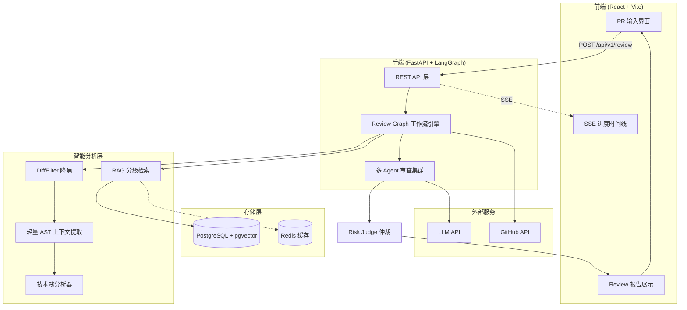
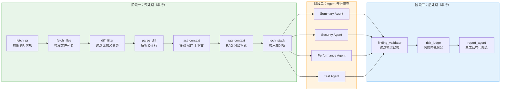
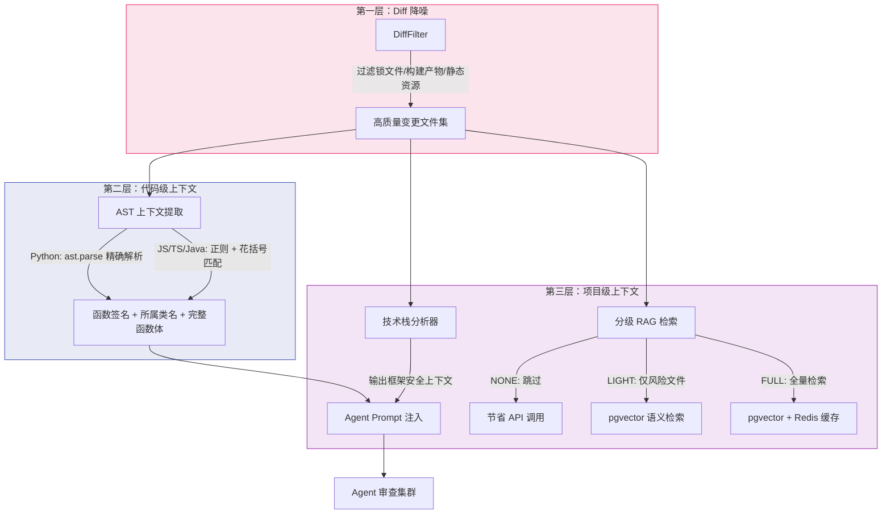

# ReviewMind

> **AI 驱动的 Pull Request 智能审查助手** — 输入 PR 链接，获得专业级 Code Review 报告。

[](https://www.python.org/)
[](https://fastapi.tiangolo.com/)
[](https://react.dev/)
[](https://langchain-ai.github.io/langgraph/)
[](LICENSE)

**[>>> 在线体验地址](https://rm.sxuan.top/)** — 无需安装，打开即用

---

## Demo

🎬 **演示视频**：[ReviewMind（心流）— AI 驱动的 PR Review 助手](https://www.bilibili.com/video/BV1yqVU6EERf?vd_source=a14af81dbe58d331448421f880c825c2)

[https://github.com/user-attachments/assets/aeb74279-0767-4173-8caa-71fa41da0d45](https://github.com/user-attachments/assets/aeb74279-0767-4173-8caa-71fa41da0d45)


---

## 核心亮点

### 1. 六 Agent 协同审查架构

不是简单的单次 LLM 调用，而是模拟真实团队的 Code Review 流程：

```
Summary Agent  ──→  宏观概览 PR 意图与变更范围
Security Agent ──→  专注 SQL 注入、XSS、CSRF 等安全漏洞
Performance Agent ──→  捕获 N+1 查询、内存泄漏、算法复杂度问题
Test Agent ──→  评估测试覆盖率与测试质量
Risk Judge    ──→  仲裁各 Agent 输出，合并重复发现，按置信度排序
Report Agent  ──→  生成结构化报告与 GitHub Review Comment
```

每个 Agent 拥有独立的 System Prompt 和审查视角，最终由 Risk Judge 统一仲裁，避免单一模型的盲区。

### 2. 技术栈感知 — 智能减少误报

ReviewMind 会先分析项目使用的技术框架，自动注入安全上下文到审查 Prompt：

- 识别 React → 自动跳过 JSX XSS 误报（React 自动转义）
- 识别 Django/Flask → 标记 ORM 参数化查询，减少 SQL 注入误报
- 识别 Spring → 标注 @Valid 注解，减少参数校验误报

这使得安全审查的**信噪比大幅提升**，开发者不再被大量无效告警淹没。

### 3. RAG 分级检索 — 精准上下文注入

根据 PR 风险等级自动选择检索策略：


| 级别    | 触发条件          | 检索范围               |
| ----- | ------------- | ------------------ |
| NONE  | 小改动、无风险关键词    | 跳过 RAG，节省 API 调用   |
| LIGHT | 部分风险文件        | 仅对高风险文件检索历史 Review |
| FULL  | 大规模变更、安全/认证相关 | 全量检索历史 Review 上下文  |


### 4. 轻量 AST 方法级上下文提取

不依赖重量级 AST 解析器，通过正则 + 语言规则快速定位变更所属函数：

- **支持语言**：Python、JavaScript、TypeScript、Java
- **提取内容**：函数签名、所属类名、完整函数体
- **效果**：Agent 审查时能看到变更代码的完整上下文，而非孤立的 diff 行

### 5. DiffFilter 智能降噪

自动过滤无审查价值的文件变更：

- `package-lock.json` / `yarn.lock` 等锁文件
- 构建产物（`dist/`、`build/`）
- 静态资源（图片、字体）
- 自动生成的文件

确保 LLM Token 全部用在有价值的代码审查上。

### 6. 实时进度推送（SSE）

前端通过 Server-Sent Events 实时展示分析进度：

```
[████████░░░░░░░░] 50% — Security Agent 正在审查认证模块...
```

每个 Agent 开始和完成时都会推送进度，用户无需盲目等待。

---

## 设计思路

### 需求分析：开发者在 Code Review 中的真实痛点

通过调研开发者日常 PR Review 流程，我们识别出以下核心痛点：


| 痛点        | 现状                                            | ReviewMind 的解法                                                        |
| --------- | --------------------------------------------- | --------------------------------------------------------------------- |
| Diff 信息过载 | 一个 PR 可能包含数十个文件变更，人工逐行审查耗时巨大                  | DiffFilter 降噪 + AST 方法级上下文提取，让 LLM 聚焦有价值的代码                           |
| 上下文割裂     | 只看 diff 行无法理解变更的完整语义                          | 轻量 AST 提取变更所属函数/类的完整代码，RAG 检索项目历史相似代码                                 |
| 审查视角单一    | 单人审查容易遗漏安全、性能、测试等维度                           | 六个专项 Agent 并行分析，覆盖安全/性能/测试/架构/风格/摘要                                   |
| 误报淹没信号    | 通用 AI 审查工具对 React 项目报 XSS、对 Django 项目报 SQL 注入 | 技术栈感知 + Finding Validator 规则过滤，自动排除框架自带防御机制的误报                        |
| 审查结果缺乏结构  | LLM 输出的自然语言建议难以直接转化为可操作的 Review Comment       | Risk Judge 仲裁 + Report Agent 生成带置信度的结构化报告，一键复制为 GitHub Review Comment |


### 系统整体架构




### LangGraph Review 工作流

核心工作流基于 LangGraph 编排，分为三个阶段——**预处理（串行）→ Agent 分析（并行）→ 后处理（串行）**：




**设计决策**：预处理阶段串行是因为后续节点依赖前置节点的输出（如 AST 上下文依赖 Diff 解析结果）；四个审查 Agent 之间无数据依赖，因此并行执行以降低总耗时；后处理串行是因为 Risk Judge 需要聚合所有 Agent 输出。

### Agent Loop 灰度编排

可选的 Agent Loop 编排路径，用于把原有固定图流程升级为更接近真实 Agent 的「规划 → 执行 → 聚合」闭环：

```text
ReviewGraph
  └─ ReviewOrchestrator（通过 REVIEW_USE_AGENT_LOOP 灰度开关接入）
      ├─ PlannerAgent：基于 PR 上下文生成审查计划
      ├─ Executor：按审查维度并行执行工具化审查
      └─ Finalizer：聚合维度结果并生成最终报告
```

这条路径默认关闭，保留原有 LangGraph 编排作为稳定路径。开启后，Planner 使用 OpenAI 原生 Function Calling 调用工具，而不是只依赖一次性 Prompt 输出。

配套能力包括：

- `Tool` 抽象与 LLM 工具调用驱动。
- 复用现有审查 service 的 Planner / Executor 工具集。
- Planner ReAct 多轮规划循环。
- Executor 并行执行与 Finalizer 结果聚合。
- `scripts/smoke_test_agent_loop.py` 端到端冒烟脚本，用于验证真实 LLM 工具调用链路。

### 上下文获取策略

ReviewMind 的核心竞争力在于「给 LLM 看到正确的上下文」。我们设计了三层上下文获取策略：




**关键设计**：

- **AST 上下文**：Python 使用标准库 `ast` 模块精确解析函数/类边界；JS/TS/Java 使用正则匹配函数声明 + 花括号配对推断函数体范围。不引入 tree-sitter 等重量级依赖，保证启动速度和部署轻量化。
- **RAG 分级**：小改动跳过 RAG 节省 API 调用；中等改动仅对安全/认证相关文件检索；大规模变更全量检索。分级依据包括变更行数、风险关键词命中数、风险文件路径匹配数。
- **技术栈感知**：通过扫描 `requirements.txt`、`package.json` 等依赖文件推断项目框架（React/Django/SQLAlchemy 等），生成框架安全上下文注入到每个 Agent 的 System Prompt 中。

### 模型选择策略


| 组件                                      | 模型策略                     | 原因                                  |
| --------------------------------------- | ------------------------ | ----------------------------------- |
| 审查 Agent（Security / Performance / Test） | 配置化，支持 GPT-4o / Claude 等 | 不同模型在安全、逻辑、推理维度各有优势，通过配置切换          |
| Summary Agent                           | 轻量模型即可                   | 摘要生成对推理深度要求较低                       |
| Risk Judge                              | 规则引擎 + 统计                | 仲裁逻辑基于确定性规则（去重、置信度排序），不消耗 LLM Token |
| Report Agent                            | 模板化生成                    | 结构化报告基于 Risk Judge 输出模板渲染，无需 LLM    |


**Token 优化**：DiffFilter 过滤无价值文件、RAG 分级跳过低风险场景、AST 提供精准上下文而非全量代码，三者协同将 LLM Token 消耗控制在有效范围内。

### 误报控制机制

ReviewMind 采用「规则 + 上下文」双重误报控制：

**第一重：技术栈感知注入** — 在 Agent 审查前，告知模型「本项目使用 React，JSX 自动转义 HTML」，让模型在推理阶段就减少此类误报。

**第二重：Finding Validator 规则过滤** — Agent 输出 findings 后，基于确定性规则做最终过滤：

```python
# 规则示例
("React",  ["xss"],                  [".tsx", ".jsx"])  → 丢弃 React 文件中的 XSS 告警
("SQLAlchemy", ["sql_injection"],     无)             → 丢弃 ORM 项目中的 SQL 注入告警
("Pydantic",   ["input_validation"],  无)             → 丢弃 Pydantic 校验相关告警
("Django 模板", ["xss"],             [".html"])         → 丢弃 Django 模板中的 XSS 告警
```

### 未来扩展方向


| 方向                | 描述                                              | 可行性                                        |
| ----------------- | ----------------------------------------------- | ------------------------------------------ |
| **增量 Review**     | 仅对新 push 的 commit 做增量分析，避免全量重复审查                | 需要缓存已审查的 commit SHA                        |
| **团队定制规则**        | 支持用户自定义安全规则、误报过滤规则、审查优先级                        | 可基于现有 `_FALSE_POSITIVE_RULES` 扩展为可配置 YAML  |
| **更多语言支持**        | AST 上下文提取扩展到 Go、Rust、C++                        | 需引入 tree-sitter 或 language-specific parser |
| **Review 历史学习**   | 将人工采纳/拒绝的 Review 建议反馈到 RAG 知识库，持续提升准确率          | pgvector 已就绪，需设计反馈采集流程                     |
| **多仓库知识库**        | 跨仓库检索相似代码模式，适用于微服务架构                            | 扩展 CodeRetriever 支持多 repo_url 索引           |
| **自定义 Agent**     | 允许用户注册自定义审查维度（如合规性、许可证检查）                       | Agent 框架已模块化，新增 Agent 只需实现 Prompt + 节点     |

---

## 项目结构

```text
.
├── backend/        # FastAPI 后端服务
├── frontend/       # React + Vite 前端应用
├── docs/           # 架构与设计文档
├── .github/        # PR 模板
└── docker-compose.yml
```

## 环境要求

- Python 3.12+
- Node.js 22+
- Git
- 操作系统：Windows / macOS / Linux

## 后端启动

```bash
cd backend
python -m venv .venv
.venv\Scripts\activate   # Windows
# source .venv/bin/activate  # macOS/Linux
pip install -r requirements.txt
copy .env.example .env   # Windows
# cp .env.example .env      # macOS/Linux
uvicorn app.main:app --reload --host 0.0.0.0 --port 8000
```

健康检查：

```bash
curl http://localhost:8000/api/v1/health
```

## 前端启动

```bash
cd frontend
npm install
copy .env.example .env   # Windows
# cp .env.example .env      # macOS/Linux
npm run dev
```

访问：

```text
http://localhost:5173
```

## Docker Compose 启动

### 方式一：使用预构建镜像（推荐）

```bash
# 1. 复制并配置环境变量
cp backend/.env.example backend/.env
# 编辑 backend/.env 填入你的 GITHUB_TOKEN 等配置

# 2. 启动服务
docker-compose up -d
```

首次启动后，可通过以下命令更新到最新镜像：

```bash
docker-compose pull && docker-compose up -d
```

### 方式二：本地构建

```bash
docker-compose up --build -d
```

### 服务地址


| 服务     | 地址                                                       |
| ------ | -------------------------------------------------------- |
| 前端     | [http://localhost:80](http://localhost:80)               |
| 后端 API | [http://localhost:8000](http://localhost:8000)           |
| API 文档 | [http://localhost:8000/docs](http://localhost:8000/docs) |


### 环境变量配置

可通过 `backend/.env` 文件或环境变量覆盖默认配置：
| 变量                       | 默认值        | 说明                                  |
| -------------------------- | ------------- | ------------------------------------- |
| `POSTGRES_DB`              | reviewmind    | 数据库名                              |
| `POSTGRES_PORT`            | 5432          | PostgreSQL 端口                       |
| `BACKEND_PORT`             | 8000          | 后端 API 端口                         |
| `FRONTEND_PORT`            | 80            | 前端访问端口                          |
| `REDIS_PASSWORD`           | (空)          | Redis 密码                            |
| `REVIEW_USE_AGENT_LOOP`    | false         | 是否启用 Agent 灰度编排路径      |
| `EMBEDDING_API_BASE`       | ai.sxuan.top  | OpenAI 兼容向量模型服务地址           |
| `EMBEDDING_MODEL`          | text-embedding-3-small | 向量模型名称                  |
| `EMBEDDING_DIMENSIONS`     | 1536          | 向量维度                              |
| `EMBEDDING_EXTRA_HEADERS`  | {}            | 向量服务额外请求头，支持 Gitee 容灾头 |

Gitee Serverless 向量模型配置示例：

```env
EMBEDDING_API_KEY=your_gitee_access_token_here
EMBEDDING_API_BASE=https://ai.gitee.com/v1
EMBEDDING_MODEL=Qwen3-Embedding-8B
EMBEDDING_DIMENSIONS=1024
EMBEDDING_EXTRA_HEADERS={"X-Failover-Enabled":"true"}
```

注意：`Qwen3-Embedding-8B` 固定输出 1024 维，如从 1536 维模型切换，需要按当前数据库方案重建 pgvector 索引。

### Agent Loop 冒烟测试

在 `backend/.env` 配置真实可用的 `LLM_API_KEY`，并关闭 mock：

```env
LLM_MOCK_MODE=false
REVIEW_USE_AGENT_LOOP=true
```

然后在 `backend/` 目录运行：

```bash
python ../scripts/smoke_test_agent_loop.py <PR_URL>
```

该脚本会输出 Planner 的工具调用步骤、Executor 维度执行结果和 Finalizer 聚合报告，用于确认 Function Calling 工具链路真实可用。

### 第三方依赖

**后端依赖（Python）：**


| 依赖                           | 用途                        |
| ---------------------------- | ------------------------- |
| FastAPI                      | Web 框架，提供 REST API        |
| Pydantic / pydantic-settings | 数据校验与配置管理                 |
| Uvicorn                      | ASGI 服务器                  |
| httpx                        | 异步 HTTP 客户端，调用 GitHub API |
| LangGraph                    | 多 Agent Review 工作流编排引擎    |
| SQLAlchemy                   | ORM 与数据库访问层               |
| aiosqlite                    | 异步 SQLite 驱动（开发 / 轻量部署）   |
| asyncpg                      | 异步 PostgreSQL 驱动（生产部署）    |
| pgvector                     | PostgreSQL 向量相似度检索        |
| Redis                        | 缓存与异步消息队列                 |
| python-dotenv                | 环境变量加载                    |
| pytest / pytest-asyncio      | 测试框架                      |


**前端依赖（TypeScript）：**


| 依赖                     | 用途         |
| ---------------------- | ---------- |
| React 19               | UI 框架      |
| React Router DOM 7     | 客户端路由      |
| Vite 6                 | 构建工具与开发服务器 |
| TypeScript             | 类型系统       |
| TanStack React Query 5 | 服务端状态管理    |
| Zustand 5              | 客户端状态管理    |
| Tailwind CSS 4         | 样式框架       |
| shadcn / Radix UI      | UI 组件库     |
| Framer Motion          | 动画库        |
| Lucide React           | 图标库        |


